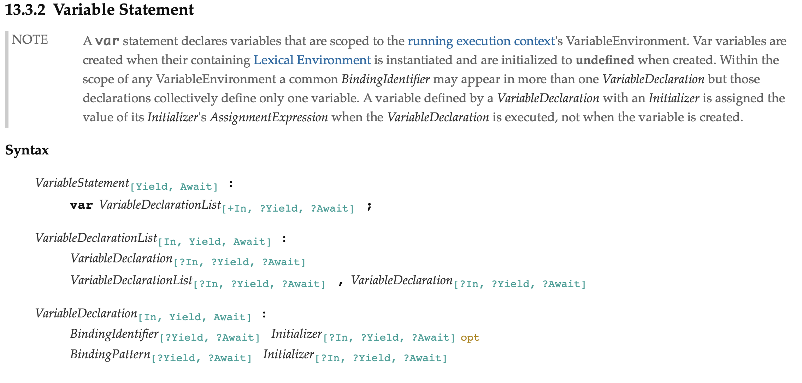

여기, 많은 자바스크립트 프로그래머들 사이에서 널리 퍼진 이야기가 하나 있습니다.
바로 "var 문에서 `var`를 생략할 수 있다" 라는 이야기입니다.

```javascript
var a = 1; // 이게
a = 1; // 이것과 같다는 이야기입니다. 
```

[구글](https://www.google.com/search?client=safari&rls=en&q=%EC%9E%90%EB%B0%94%EC%8A%A4%ED%81%AC%EB%A6%BD%ED%8A%B8+var+%EC%83%9D%EB%9E%B5&ie=UTF-8&oe=UTF-8) 검색 결과가 말해주듯이, 이 이야기는 정말, 정말 널리 퍼져있습니다.
그렇지만, 이 이야기는 사실이 아닙니다. **`var`은 생략할 수 없습니다.**

오늘은 **`var` 생략 문법이 존재하지 않음**을 다섯 가지 이유를 통해 보여드리도록 하겠습니다.

## 1. `var` 생략형이라 알려진 코드는 `var` 문의 문법 정의에 포함되지 않는다

가장 확실한 레퍼런스죠, [자바스크립트의 명세](https://www.ecma-international.org/publications/standards/Ecma-262.htm)의 [var 문 정의](https://www.ecma-international.org/ecma-262/10.0/index.html#sec-variable-statement)에는 `var` 예약어가 var 문에서 필수적인 요소임이 나타나 있습니다.



위 사진은 var 문의 문법 정의입니다. `var` 문이라고 부를 수 있는 코드의 형태가 묘사되어 있지요. 하지만 `var`을 포함하지 않는 형태는 찾아볼 수 없습니다.
즉, 흔히 "변수 선언을 내포한/`var`을 생략한 형태이다" 라고 언급하는 `variable = value` 꼴의 코드는 **var 문이 아닙니다**.

## 2. `var` 생략형이라 알려진 코드는 사실 대입 표현식(Assignment expression)입니다

여기, 비구조화 바인딩 패턴을 `var` 문에서 사용하는 예가 있습니다.

```javascript
var { x } = { x: 1 };
```

만약 `var` 문에서 `var`을 생략할 수 있다면, 위 코드에서 `var`을 제거하였을 때에도 변함없이 작동해야 합니다. 
하지만 현실은 그렇지 않습니다. 
위 예에서 `var`를 제거하면 `{ x } = { x: 1 };`의 첫 번째 `{`가 비구조화 바인딩 패턴의 시작을 의미하는 중괄호가 아닌, 블록 문의 시작을 알리는 중괄호로 해석되어 결과적으로 블록 문에 객체를 대입하는 꼴의 올바르지 않은 코드가 되기 때문입니다.

단순히 `var`의 존재 유무에만 차이가 있을 뿐인데 해석에서 왜 이렇게나 큰 차이가 나는 걸까요? 
이유는 간단합니다. 
`var`이 생략된 형태의 `var` 문이라 알려진 코드는 사실 대입 표현식이며, 자바스크립트에서는 구문으로서 표현식을 사용할 때 `{` 로 시작하는 표현식은 사용될 수 없기 때문입니다.
그렇기 때문에 대입 표현식으로의 해석이 불가능해지고, `{` 는 블록 문의 시작을 알리는 좌측 중괄호로 해석되는 것이지요.

`var` 문에 비구조화 바인딩이 아닌 경우도 같습니다. 단지 이 경우에는 문제 없이 대입 표현식으로 바로 해석되기 때문에 오류가 나지 않을 뿐이지요.
그래도 코드가 변수 선언이 아니라 단순한 표현식인 건 변하지 않습니다.

## 3. `var` 생략형이라 알려진 코드는 let 등을 통한 선언과 이름이 겹쳤을 때 오류가 나지 않습니다

만약 `var` 생략형이 `var` 문과 같다면, 아래의 코드는 분명히 오류를 내야 합니다.

```javascript
let a = 1;

a = 2; // var a = 2; 의 경우 오류가 발생합니다.
```

하지만 실제로는 그렇지 않지요.

## 4. `var` 생략형이라 알려진 코드가 정의하는 변수는 호이스팅 되지 않습니다

`var a = !a;`가 실행된 후의 `a`의 값은 `true`입니다.
`!a` 를 해석하기 전에 `undefined`로 초기화된 변수 `a`가 만들어지기 때문이죠.

만약 `var` 생략형이 존재한다면, `a = !a`가 실행된 후의 `a`의 값은 `true`여야 합니다.
하지만 실제로는 끝까지 실행되지도 못하고 오류를 발생시킵니다.
`!a`를 해석할 때 `a`라는 변수가 존재하지 않기 때문이죠. 

세상 어떤 문법적 설탕(syntactic sugar)이 원본이랑 상이하게 작동하나요. 
둘은 전혀 다른 의미를 갖는 코드라는 말이지요.

## 5. `var` 생략형이라 알려진 코드는 표현식인 반면, `var` 문은 구문입니다

`var` 문은 구문이기 때문에 `function f(x) {}` 이 있을 때, `f(var x = 1);` 은 오류를 발생시킵니다. 
구문은 함수의 몸체를 구성하는 경우가 아닌 이상 표현식의 일부가 될 수 없기 때문이죠. 

만약 `var` 생략형이 존재한다면, `var` 문의 문법적 설탕이니 구문이여야 합니다.
그렇다면 `var x = 1`의 `var` 생략형인 `x = 1`으로 위의 코드를 수정해도 오류는 계속 발생할 겁니다.
하지만 `f(x = 1)`은 정상적으로 실행됩니다. 
`x = 1`은 두번째 이유에서 언급했다시피 표현식이기 때문이죠.

즉, `var` 문과 `var` 생략형이라 알려진 코드는 각각 구문과 표현식으로, 기본 성질부터 서로 다른 이종입니다.

## 결론

지금까지, 너무 깊게 들어가지 않으면서 `var` 문에 대한 유명한 이야기인 "`var` 문에서 `var`을 생략할 수 있다"를 파헤쳐 보았습니다.
널리 알려진 이야기와는 다르게 `var` 문에서는 `var`을 생략할 수 없다는 점과 `var`을 생략한 형태로 알고 지내던 코드가 사실은 대입 표현식이였다는 점을 다루어 보았는데요, 이제는 `var` 생략형이라 부르던 것들을 **대입 표현식**이라는 정확한 명칭으로 부르시는 게 어떨까 싶습니다.
그럼 저는 여기서 이만 글을 마치도록 하겠습니다. 
긴 글 읽어주셔서 감사합니다.