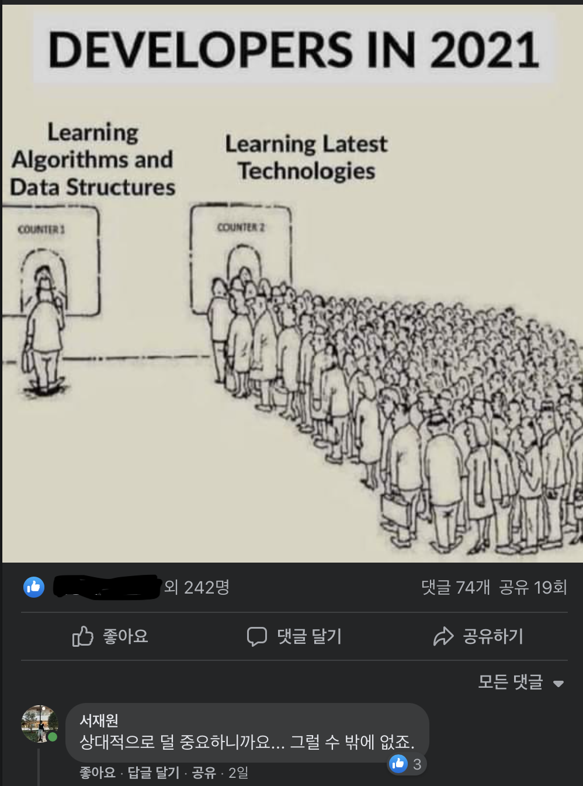

오랜만입니다. 이 블로그도, 프로그래밍 커뮤니티도. 본래라면 내신 공부에 매달리고 있어야 할 제가 블로그에 글이나 쓰고 있는 사연은 이러합니다.

지나가다 댓글을 달았습니다. “상대적으로 덜 중요하니까요… 그럴 수 밖에 없죠.” 라고. 그러자 불판이 깔리고 콜로세움이 열리더군요. 처음에는 댓글에서 논쟁을 이어가고자 했으나, 제가 하고자 하는 이야기를 더 많은 분들께서 듣고 생각해 주셨으면 하는 바람이 생겼기에 이렇게 블로그에 제 생각을 정리해 올려 보고자 합니다.

이 글을 읽고 제 의견에 동의하시든 아니든, 혹은 제가 미처 고려하지 못한 다른 어떤 주장을 내놓으시든 잘못될 건 없습니다. 당장 제 아버지께서도 저와 다른 의견을 가지고 계신걸요. 제가 여러분들께 기대하는 단 한 가지는 바로 소통입니다. 저는 여러분들의 고견이 궁금합니다. 부디 이메일이든, 블로그 글이든, 어떤 매체여도 상관 없으니 여러분의 의견을 자유롭게 표현해 주세요.

## 제 주장이 아닌 것들

모든 이야기를 시작하기 앞서, 제 주장이 아닌 것들을 명확하게 하고 넘어가도록 하겠습니다. 하지도 않은 이야기로 비판받는 것 만큼 억울한 일은 없으니까요.

1. 알고리즘과 자료구조는 무가치하다.
2. 알고리즘과 자료구조를 몰라도 좋은 프로그래머가 될 수 있다.

확실히 하겠습니다. 위의 주장들은 제 주장과는 무관하며, 저 또한 좋은 프로그래머가 되기 위해서는 알고리즘과 자료구조를 공부해야 한다는 데에 동의합니다. 더 나아가, 알고리즘과 자료구조가 컴퓨터 과학에 있어 무시할 수 없는 영향력을 지닌다는 것에도 동의합니다. 분명히 알고리즘과 자료구조는 더 명확하고 효율적인 코드를 작성하는 데 유용한 지식입니다.

그러나 과연 모든 프로그래머가 알고리즘과 자료구조를 우선적으로 익혀야 할까요? 제가 의문을 표하고자 하는 부분은 바로 이 부분입니다.

## 제 주장

저는 모든 프로그래머가 알고리즘과 자료구조를 우선적으로 익힐 필요는 없다고 생각합니다.
물론 프로그래밍을 학문적으로 접근하고자 한다거나, 앞으로 사용할 기술들의 세부적인 원리를 탐구하고 싶다면야 알고리즘과 자료구조를 먼저 익혀야겠지만, 그렇지 않다면 추상 자료 구조(Abstract Data Structure)만 살펴보고 그 외의 것들은 나중에, 필요에 따라 공부해도 충분하다고 생각합니다.

여러 번 이야기하지만, 분명 자료구조와 알고리즘 지식은 유용합니다. 코드를 한층 더 아름답고 빠르게 해 주겠지요. 그런데 과연 속도와 아름다움이 프로그래밍에 있어 가장 중요한 가치일까요? 전업 프로그래머의 존재 의의는 생산입니다. 고용주가 프로그래머에게 기대하는 것은 주어진 자원을 효율적으로 사용해 최선의 제품을 개발하는 일입니다. 이러한 점을 고려하였을 때, 빠른 알고리즘이나 최적화된 자료구조를 사용하며 수 밀리세컨드의 실행 시간을 줄이는 것 보다 사용자에게 매력적이게 다가갈 수 있는 기능 하나를 더 개발하고 버그를 하나라도 더 잡는 게 유익하다고 볼 수 있겠습니다. 고객과 고용주는 수 밀리세컨드의 성능 개선 같은 건 모릅니다. 인지하지도 못할 속도 지연보다 당장 눈 앞의 불편한 버그나 UI, 기능들이 더 눈에 거슬릴 뿐입니다. 프로그래머가 우선적으로 익혀야 할 것은 성능 튜닝에나 도움이 될 알고리즘과 자료구조 관련 지식이 아니라 자신의 생산성을 높일 수 있는 기술들 — 논란이 시작된 원 글에서는 ‘Latest Technologies’ -- 입니다. 구슬이 서 말이어도 꿰어야 보배이듯이, 성능 튜닝을 하려면 일단 제품이 있어야 하는 법 아니겠습니까?

혹자는 알고리즘과 자료구조를 우선적으로 익혀야 하는 이유로 이것들이 컴퓨터 과학의 근간을 이루는 기초라는 점을 듭니다. 저는 이러한 주장에 질문을 하나 던지고 싶습니다. “어떤 기술을 사용하기 위해서는 무조건 그 기술의 근간이 되어주는 기술들을 익혀야 할까요?” 컴퓨터 과학이 고도화되면서 이루어진 추상화 작업은 프로그래머들로 하여금 수많은 기반 지식들을 잊거나 잊어도 되게끔 해 주었습니다. 예컨대, 가비지 컬렉터의 발명 이후로 프로그래머들은 더 이상 메모리 구조를 생각하지 않아도 프로그래밍을 할 수 있게 되었으며, 파이어베이스와 같은 BaaS의 등장 이후로 프로그래머들은 간단한 백엔드 개발에서 자유를 얻게 되었습니다. 이 뿐만이 아닙니다. 굳이 추상화를 끌어오지 않아도 프로그래머들이 배경 이론이나 지식 없이 사용하는 기술들은 수도 없이 많이 있습니다. 많은 프로그래밍 언어에 내장된 타입 시스템, 과연 전 세계의 프로그래머 중에서 타입 이론을 공부하고 타입 시스템을 사용하는 사람은 몇 퍼센트나 될까요? 애초에 그런 주장을 하는 사람이 있기야 했나요? “타입 시스템이 있는 언어를 공부하려면 먼저 타입 이론을 공부해라!”. 여기서 끝이 아닙니다. 데이터베이스는요? OAuth는요? MS Azure와 같은 클라우드 서비스는요? 그리고 많은 분들이 좋아하시는 리액트는요? 리액트를 쓰기 위해서 Algebraic Effect를 공부해야 한다는 주장을 하는 사람이 있던가요? 생각해보면 참 신기하지 않나요. 다른 기반 지식과 달리 자료구조와 알고리즘만 특별 대우를 받고 있습니다. 도대체 무슨 차이인 걸까요? 근본적이다? 타입 이론이나 메모리 구조, 데이터베이스 이론이 컴퓨터 과학의 근본이 아니라고 하는 건 억지 아닐까요? 저는 도저히 명확한 차별점을 찾지 못하겠습니다.

물론 게임 프로그래밍이나 로켓 프로그래밍, 또는 운영체제 프로그래밍과 같이 빠른 속도와 아름다운 구조가 필요한 경우가 있기야 하겠고, 일반적인 프로덕트라 하더라도 마찬가지로 성능 개선이 필요한 시점이 오기야 하겠습니다. 저는 이 때가 바로 알고리즘과 자료구조를 깊이 있게 익힐 순간이라고 생각하며, 전혀 늦지 않은 시점이라고 생각합니다. 반대로 말하자면, 이 시점 전 까지는 굳이 알고리즘과 자료구조를 우선적으로 공부할 필요가 없다고 생각합니다. 앞서 이야기했듯이 더 급한 기술들이 많이 있으니까요.

마지막으로 제 주장의 산증인인 [리액트 코어 팀의 Dan Abramov](https://github.com/gaearon)를 소개하며 글을 마무리하겠습니다. [알고리즘도 잘 모르시지만](https://overreacted.io/things-i-dont-know-as-of-2018/) [17만개의 스타를 받은 라이브러리](https://reactjs.org)를 메인테이닝하고 계시지요. 알고리즘과 자료구조는 여러분들 생각만큼 중요하지는 않습니다.