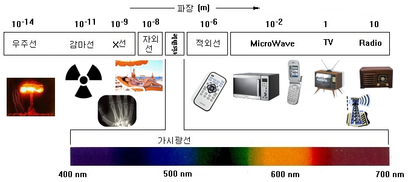

[500마일 이메일 문제](https://edykim.com/ko/post/500-mile-email-problem/)나 [바닐라 아이스크림 알러지 자동차 이야기](https://www.clien.net/service/board/park/14924850)를 들어 본 적 있는가? 엔지니어링이 우연과 만나면 얼마나 기상천외한 현상이 벌어질 수 있는지 알려주는 대표적인 이야기들이다.

그러나 오늘의 주제는 앞선 이야기들이나 그 이야기들의 교훈이 아니다. 대신, 우리 집에 살고 있는 와이파이를 잡아먹는 괴물이다.

우리 집에는 와이파이를 잡아먹는 괴물이 살고 있다. 무슨 귀신 씻나락 까먹는 소리냐고 생각할 수 있겠지만은, 사실이다. 어느 순간 우리 집에 눌러앉아 살기 시작한 이 괴물 이야기를 오늘 풀어 보려고 한다.

이 괴물을 내가, 그리고 우리 가족이 인식한 지는 몇 달 정도 되었다. 막연하지만 분명 어느 시점까지는 우리 집 와이파이에서 어떤 결함도 찾을 수 없었다. 우리 집이 전화가 안 터지는 매우 특이한 집이긴 했지만 와이파이는 늘 다섯 칸을 안정적으로 유지하고 있었다.

그러나 몇 달 전, 우리 집의 평화는 이 괴물이 갑작스레 등장함으로써 무너졌다. 처음에는 귀신인 줄 알았다. 잘만 되던 와이파이가 툭하면 한 칸 아래로 내려가면서 끊겨버리니까 당혹스럽기 그지없었다. 공유기와 벽 한 칸을 사이에 두고 있는 내 방에서도 같은 현상이 반복되었다.

더 기막힌 점은, 이 귀신이 생각보다 규칙적이라는 것이었다. 이 귀신은 정확히 저녁 5\~6시 사이와 8\~9시 사이에는 매일 한 번씩 와이파이를 끊어놓고 있었다. 처음에는 뭐 이런 별난 귀신이 다 있나 싶었다.

이러나 저러나, 온라인 수업을 듣다 줌에서 튕긴 사람, 영화에 한창 몰입했는데 넷플릭스가 멈춘 사람, 그리고 fps 게임에서 핑이 500을 찍는 걸 본 사람의 분노는 오컬트 따위가 주는 공포감을 아득히 넘어섰고, 나, 그리고 우리 가족은 이 귀신을 퇴치하기 위해 노력하기 시작했다.

가장 먼저 세운 가설은 공유기 근처에 장애물이 너무 많아서 전파가 잘 터지지 못한다는 것이었다. 귀신의 규칙적인 행동은 해명하지 못하지만 그래도 이것저것 잡동사니가 쌓여 있는 공유기 주위를 보면 기술적으로도 말이 될 뿐더러, 저런 환경이면 진짜 귀신이 들려도 문제가 없으리라 생각했다. 그러나, 주위를 청소하고 전파가 잘 터질 만한 선반에 공유기를 올려두어도 별다른 성과를 얻지 못했다. '고스트 버스터즈'의 첫 번째 작전은 이렇게 수포로 돌아갔다.

몇 차례의 실패를 거치면서 간헐적으로 생기는 인터넷 장애에 익숙해진 우리 가족은 괜시리 복잡하게 이 문제를 해결하는 대신에 이 귀신과 함께 살아가기를 택했다. 생각해 보면, 사람을 잡아먹고 집안을 망가뜨리는 옛날 이야기의 귀신들이나 '곤지암' 따위의 영화에서 나오는 괴상망측하게 생긴 귀신들에 비하면 이 녀석은 매우 순박한 녀석이지 않은가? 고작 한다는 게 가끔씩 와이파이를 잡아먹는다는 것뿐이니 말이다.

이야기는 내가 물리학 1 수업 시간에 전자기파에 대해 배우면서 새로운 국면을 맞이한다. 전자기파, 우리가 흔히 '전자파'라 부르는 이 녀석들은 진동수에 따라서 몇 가지 분류로 나뉜다.

와이파이가 사용하는 전자파의 진동수는 보통 2.4GHz로, 이 중 마이크로파에 속한다. 물론 기술이 발전해 5GHz를 사용하는 공유기도 있지만은 우리 집 공유기는 2.4GHz를 사용한다.

전자레인지의 원리를 아는가? 간단하게 말하자면 음식에 파동을 쪼여 음식 안의 물 분자를 진동시키고, 그 결과로 일어나는 발열 현상을 이용해 음식을 뎁히는 기기가 전자레인지이다.

“우리 집 와이파이가 사용하는 전자파는 마이크로파(microwave), 전자레인지는 영어로 마이크로웨이브(microwave)” 불길한 예감이 머리를 스쳤다.

집에 돌아오는 대로 휴대폰으로 넷플릭스를 틀었다. 아무 영상이나 재생시킨 후, 전자레인지를 2분에 맞추고 작동시켰다. 전자레인지가 작동하자, 귀신같이 재생되던 영상이 멈춰버렸다. 2분이 지나고, 전자레인지가 경쾌한 알람 소리를 내며 멈추자, 멈췄던 영상이 다시 재생되었다.

유레카!

관측한 현상을 바탕으로 가설을 다시 정리했다. 전자레인지가 파동을 발생시키기 시작하면 와이파이가 연결되지 않는 것으로 보아 전자레인지의 파동과 와이파이의 파동(전자파)가 간섭함은 분명했다. 그런데 왜? 왜 전자레인지는 2.4GHz의 파동을 굳이 사용하는 걸까? 잠깐의 고민 끝에 한 가지 키워드가 떠올랐다. ‘공명(Resonance)’

군인들이 일정한 박자로 행진하다 다리를 무너뜨렸다는 이야기를 들어 보았는가? 혹은 소프라노가 고음을 내 유리잔을 깨뜨리는 실험을 본 적 있는가? 모든 물질은 ‘고유진동수’라 일컫는 특정한 진동수 값을 갖는다. 이 진동수 값에 해당하는 파동이 물질에 도달하면 물질은 극렬히 진동하게 되는데, 이 현상을 공명이라 부른다. 앞서 이야기한 군인들이 발맞추어 행진하면 다리가 무너지는 현상 또는 소프라노가 유리잔을 깨는 현상은 모두 공명 현상의 예시이다.

여기가 정말 환장할 부분인데, 물의 고유진동수는 2.4GHz다. 물을 매우 강하게 진동시킬 수 있는 파동의 조건이 바로 2.4GHz라는 말이다. 와이파이의 주파수 — 2.4GHz —는 물 분자를 진동시키는 게 목적인 전자레인지가 목표하기 좋은 진동수였던 것이다.

물론 정상적인 전자레인지라면 차폐 기술이 적용되어 있어 마이크로파가 외부로 세어나가는 걸 막는다고 한다. 그러나, 우리 집에 있는 이 고 ㅣ물은 그런 기능따위 없었고 결과적으로 음식만 덥히는 게 아니라 우리 집 사람들 가슴에도 열불을 냈다.

무튼, 그렇게 미스테리가 풀리고, 그날로 우리 집에는 '전자레인지를 돌리기 전에 가족 모두의 동의를 받는 프로토콜'이 추가되어 오늘까지도 이어지고 있다.

우리 집에는, 나, 동생, 엄마, 아빠  
그리고 와이파이를 잡아먹는 고물이 산다.

fin.

----

추신. 그래서 이 괴물이 왜 규칙적이었냐면… 저녁 5\~6시와 8\~9시는 각각 나와 우리 아빠의 식사 시간이기 때문이었다. 나와 아빠는 냉장고에서 꺼낸 차가운 반찬거리를 뎁히기 위해 전자레인지를 돌렸고, 전자레인지는…